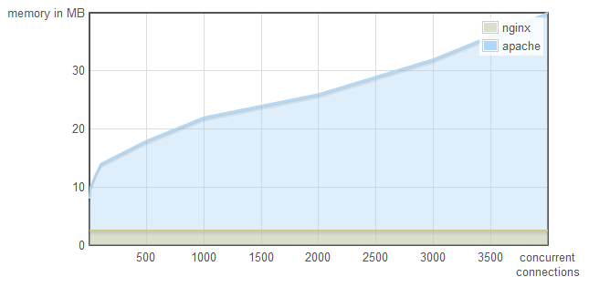

!SLIDE
# Event Driven Programming?

!SLIDE code

	@@@ javascript
	var result = db.query("select * from T");
	// Use result

!SLIDE bullets

* L1: 3 cycles
* L2: 14 cycles
* RAM: ~250 cycles
* Disk: ~41.000.000 cycles (~13.7ms read)
* Network: ~240.000.000 cycles (~80ms latency)

Source: [What your computer does while you wait](http://duartes.org/gustavo/blog/post/what-your-computer-does-while-you-wait)

!SLIDE

# Solution?

!SLIDE

# "Use Threads"

!SLIDE

# Apache

!SLIDE

# Nginx

!SLIDE center

Source: [A little holiday present: 10,000 reqs/sec with Nginx!](http://blog.webfaction.com/a-little-holiday-present)

!SLIDE center

Source: [A little holiday present: 10,000 reqs/sec with Nginx!](http://blog.webfaction.com/a-little-holiday-present)

!SLIDE

# Why?

!SLIDE

# Threads

!SLIDE

# Execution stacks

!SLIDE
# Context switching

!SLIDE
# <s>massive concurrency</s>

!SLIDE

# Threaded concurrency is a leaky abstaction

!SLIDE code small

	@@@ javascript
	var result = db.query("select * from T");
	// Use result

!SLIDE code small

	@@@ javascript
	db.query("select * from T", function (result) {
		// Use result
	});

!SLIDE

# Why doesn't everyone do this?

!SLIDE

# 1) Culture

!SLIDE code

	@@@ javascript
	puts("Enter your name: ");
	var name = gets();
	puts("Name: " + name);

!SLIDE code

	@@@ javascript
	puts("Enter your name: ");
	gets(function(name) {
		puts("Name: " + name);
	});

!SLIDE

# 2) Infrastructure

!SLIDE

# Single-threaded event loop
# requires non-blocking IO

!SLIDE

## Most libraries aren't

!SLIDE

## EventMachine, Twisted

!SLIDE

## Still require expert knowledge

!SLIDE

## Still require library support